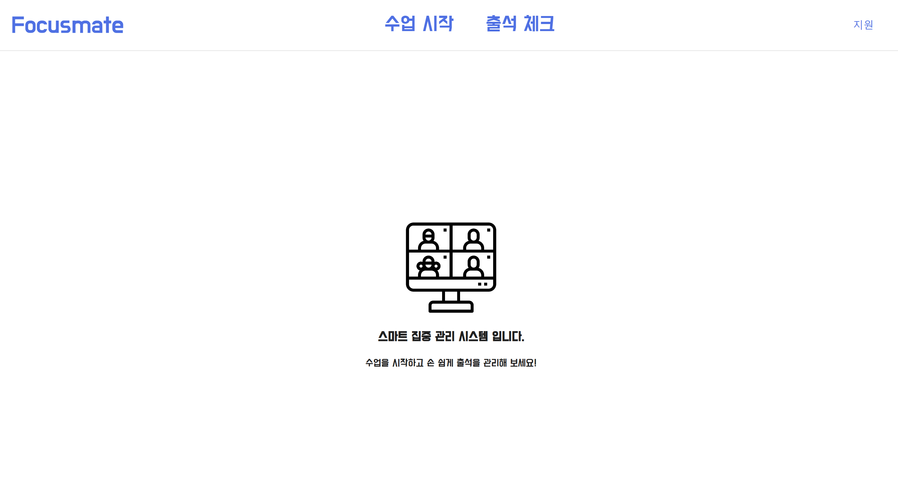

 <h1>창의공학 해결 프로젝트 <em>FOCUSMATE</em></h1>
   
 <h3>
 FOCUSMATE와 함께라면 비대면수업에서도 FOCUS
 </h3>

 
## FOCUSMATE📢
> 비대면도 확실하게! FOCUSMATE와 수업에 FOCUS👩‍🏫

### Service Introduction
 코로나 이후 비대면강의의 수요가 늘어나며 학생들의 학습격차도 더 벌어졌다는 사실 알고 계신가요?

강의를 틀어놓기만 하고 자리를 비우거나, 수업 중 잠드는 상황, 교수님들이 몇번이나 출석을 부르는 경험을 한번 쯤은 경험하셨으리라 생각합니다.
 FOCUSMATE 는 이러한 문제를 해결하기 위해 탄생하였습니다!

저희는 대학생들의 비대면 강의 수강 시 집중도를 실시간으로 체크하여 수강자에게 이 사실을 알리고 집중도 향상을 도모하고자 서비스를 기획하게 되었습니다

1. 수강자가 화면 밖으로 나갔을 경우
2. 수강자가 눈을 7초 이상 감고 졸았을 경우
3. 고개가 일정 각도 이상 떨어져 졸았다고 감지 가능한 경우

   위 3가지 경우에 수강자에게 알람과 경고메세지를 제공합니다.
   또한 교수님들의 출석 체크를 돕고자, 수업이 끝나면 수강자의 수업시간 중 집중도를 토대로 출석 여부를 결정하고, 자동으로 모달창을 띄웁니다.
   이 출석 여부는 캘린더에서 확인 가능합니다.

   

## 🎨 View & Feature

